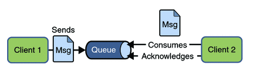
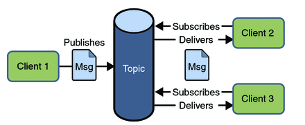
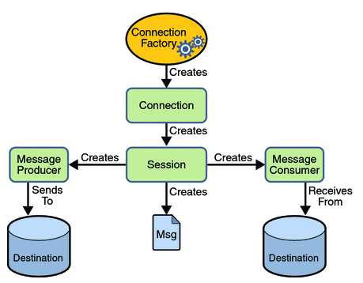
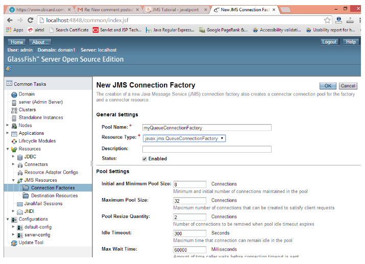
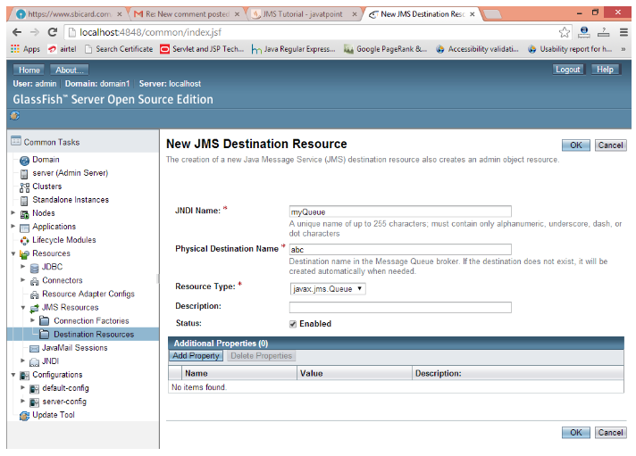

# [Java Message Service](https://www.javatpoint.com/jms-tutorial)

JMS (Java Message Service) - это API, который предоставляет возможность создавать, отправлять и читать сообщения. Он обеспечивает слабосвязанную, надежную и асинхронную связь.

## Understanding Messaging

Обмен сообщениями - это техника взаимодействия приложений или программных компонентов.

JMS в основном используется для отправки и получения сообщений от одного приложения к другому.

## Requirement of JMS

Как правило, пользователь отправляет сообщение приложению. Но если мы хотим отправить сообщение из одного приложения в другое, нам нужно использовать JMS API.

Рассмотрим сценарий, в котором одно приложение A работает в ИНДИИ, а другое приложение B - в США. Чтобы отправить сообщение из приложения A в B, нам нужно использовать JMS.

## Advantage of JMS

1) **Асинхронный**: чтобы получить сообщение, клиенту не нужно отправлять запрос. Сообщение будет поступать клиенту автоматически.

2) **Надежный**: Обеспечивает уверенность в том, что сообщение будет доставлено.

## Messaging Domains

В JMS существует два типа доменов обмена сообщениями.

1. Point-to-Point Messaging Domain
2. Publisher/Subscriber Messaging Domain

1) Point-to-Point (PTP) Messaging Domain. <br>
В модели PTP одно сообщение **доставляется только одному** получателю. Здесь очередь **Queue** используется в качестве промежуточного ПО, ориентированного на сообщения (MOM). Очередь отвечает за хранение сообщения до тех пор, пока не будет готов получатель. В модели PTP нет временной зависимости между отправителем и получателем.


2) Publisher/Subscriber (Pub/Sub) Messaging Domain. <br>
В модели Pub/Sub одно сообщение **доставляется всем подписчикам**. Это похоже на широковещательную рассылку. Здесь **Topic** используется как ориентированное на сообщения промежуточное программное обеспечение, которое отвечает за хранение и доставку сообщений. В модели PTP существует **временная зависимость** между издателем и подписчиком.


## JMS Programming Model



## JMS Queue Пример (на примере Appache ActiveMQ)

Для разработки примера очереди JMS необходимо установить любой сервер приложений. Здесь мы используем сервер **glassfish3**, на котором создаем два JNDI.

1. Создаем фабрику соединений с именем **myQueueConnectionFactory**
2. Создайте ресурс назначения с именем **myQueue**.

После создания JNDI создайте сервер и приложение-приемник. Вам нужно запустить сервер и приемник в разных консолях. Здесь мы используем eclipse IDE, и по умолчанию она открывается в другой консоли.

1) Создайте фабрику соединений и ресурс назначения

Откройте консоль администратора сервера по URL <http://localhost:4848>.

Войдите в систему, используя имя пользователя и пароль.

Нажмите на **JMS Resource -> Connection Factories -> New**, теперь напишите имя пула и выберите Resource Type как QueueConnectionFactory, затем нажмите на кнопку ok.



Щелкните на **JMS Resource -> Destination Resources -> New**, теперь напишите имя JNDI и физическое имя назначения, затем щелкните на кнопке ok.



2) Создайте приложение для отправителя и получателя

Publisher.java

```Java
 
public class Publisher {  
    public static void main(String[] args) { 
         // AciveMQConnectionFactory("broker_username", "broker_password", "broker_url");
        ConnectionFactory factory = new AciveMQConnectionFactory("admin", "admin", "tcp://localhost:61616");

        try {
            // Create connection to queue
            Connection connection = factory.createConnection();

            //create session of this connection createSession(transacted, acknowlegeMode) with parameters
            // transacted - we don't need any transactions (not need transacted = false)
            //acknowlegeMode - AUTO_ACKNOWLEDGE or CLIENT_ACKNOWLEDGE
            Session session = connection.createSession(falsa, Session.AUTO_ACKNOWLEDGE);

            // Provide the queue where we published the message
            Destination destination = session.createQueue("demo");

            //Publising new text message
            TextMessage textMessage = session.createTextMessage("First message");

            //Now we need producer to publishing this to queue
            MessageProducer producer = sesion.createProducer(destination);

            //Send message to queue
            producer.send(textMessage);

            //after we need to close session and connection
            session.close();
            connection.close();
        } catch (JMSException e) {
            e.printStackTrace();
        }
      
    }
}  
```

Consumer.java

```Java
  
public class Consumer {  
    public static void main(String[] args) {

        //1) Create and start connection  
        ConnectionFactory factory = new AciveMQConnectionFactory("admin", "admin", "tcp://localhost:61616"); 
        try { 
            Connection connection = factory.createConnection(); 

            // producer it's not need to start, but consumer we need to start 
            connection.start();  

            //2) create Queue session, parameter are similar as in producer
            Session session = connection.createSession(false, Session.AUTO_ACKNOWLEDGE); 

            //3) get the Queue from where we provide the messages  
            Destination destination = session.createQueue("demo"); 

            //4)create Consumer to consume the message  
            MessageConsumer consumer = session.createConsumer(destination);  
                
            //Получатель должен всегда прослушивать события очереди (поступающие сообщения в очередь), поэтому для этого создается слушатель.
            // 5) create listener object  
            MyListener listener=new MyListener();  
                
            //6) register the listener object with receiver  
            receiver.setMessageListener(listener); 

            //OR anonimous class 
            //  consumer.setMessageListener(new MessageListener() {
            //     public void onMessage(Message message) {
            //         TextMessage textMessage = (TextMessage) message;

             // In case CLIENT_ACKNOWLEDGE
             //         textMessage.acknowlege();
            //     }
            //  });                
        
        } catch (JMSException e) {
            e.printStackTrace();
        } 
    }  
}  
```

Получатель должен всегда прослушивать события очереди (поступающие сообщения в очередь), поэтому для этого создается слушатель.

MyListener.java

```Java
import javax.jms.*;  
public class MyListener implements MessageListener {  
  
    public void onMessage(Message m) {  
        try {  
            TextMessage msg = (TextMessage) m;  
      
            System.out.println("following message is received:" + msg.getText());  
        } catch (JMSException e) {
            e.printStackTrace();
        }  
    }  
}  
```

Запустите сначала класс Receiver, а затем класс Sender.

## Publish JSON message to queue

```Java
public class RealTimeExample {
    public static void main(String[] args) {
        // 1) Create connection
        ConnectionFactory factory = new AciveMQConnectionFactory("admin", "admin", "tcp://localhost:61616");
        try {
            // Create connection to queue
            Connection connection = factory.createConnection();

            //create session
            Session session = connection.createSession(falsa, Session.AUTO_ACKNOWLEDGE);

            // Provide the queue where we published the message
            Destination destination = session.createQueue("demo");

            // Create JSON object
            JSONObject json = new JSONObject();
            json.put("from_date", "01-Jan-2024");
            json.put("to-date", "31-Jan-2024");
            json.put("email", "xyz@gmail.com");
            json.put("query", "select * from data");

            // Create message from json
            // then after in consumer recieve the message as normal text and then extract from JSON Object
            TextMessage textMessage = session.createTextMessage(json.toString());
            //   OR
            //Publising new text normal message
            TextMessage textMessage = session.createTextMessage("First message");

            //Now we need producer to publishing this to queue
            MessageProducer producer = sesion.createProducer(destination);

            //Send message to queue
            producer.send(textMessage);

            //after we need to close session and connection
            session.close();
            connection.close();
        } catch (JMSException e) {
            e.printStackTrace();
        }
    }
}
```

## JMS Topic Пример (на примере Appache ActiveMQ)

Это то же самое, что и JMS Queue, но вам нужно изменить Queue на Topic, Sender на Publisher и Receiver на Subscriber.

Вам нужно создать 2 JNDI с именами **myTopicConnectionFactory** и **myTopic**.

Publisher.java

```Java
public class Publisher {  
    public static void main(String[] args) { 
         // AciveMQConnectionFactory("broker_username", "broker_password", "broker_url");
        ConnectionFactory factory = new AciveMQConnectionFactory("admin", "admin", "tcp://localhost:61616");

        try {
            // Create connection to topic
            Connection connection = factory.createConnection();

            //create session of this connection createSession(transacted, acknowlegeMode) with parameters
            Session session = connection.createSession(falsa, Session.AUTO_ACKNOWLEDGE);

            // Provide the queue where we published the message
            Destination destination = session.createTopic("demo-topic");

            //Now we need producer to publishing this to queue
            MessageProducer producer = sesion.createProducer(destination);
            
            //Publising new text message
            TextMessage textMessage = session.createTextMessage("Message for topic");

            //Send message to topic
            producer.send(textMessage);

            //after we need to close session and connection
            session.close();
            connection.close();
        } catch (JMSException e) {
            e.printStackTrace();
        }    
    }
}  
```

Consumer.java

```Java
  
public class Consumer {  
    public static void main(String[] args) {

        //1) Create and start connection  
        ConnectionFactory factory = new AciveMQConnectionFactory("admin", "admin", "tcp://localhost:61616"); 
        try { 
            Connection connection = factory.createConnection(); 

            //need to define client of subscriber - required
            connection.setClientID("1");

            // producer it's not need to start, but consumer we need to start 
            connection.start();  

            //2) create Topic session, parameter are similar as in producer
            Session session = connection.createSession(false, Session.AUTO_ACKNOWLEDGE); 

            //3) now we must to define Topic 
            Topic topic = session.createTopic("demo-topic");

            //4)create Consumer to consume the message  
            MessageConsumer consumer = session.createDurableSubscriber(topic, "Consumer-1");  
                
            //Получатель должен всегда прослушивать события очереди (поступающие сообщения в очередь), поэтому для этого создается слушатель.
            // 5) create listener object  
            MyListener listener=new MyListener();  
                
            //6) register the listener object with receiver  
            receiver.setMessageListener(listener); 

            //OR anonimous class 
            //  consumer.setMessageListener(new MessageListener() {
            //     public void onMessage(Message message) {
            //         TextMessage textMessage = (TextMessage) message;

             // In case CLIENT_ACKNOWLEDGE
             //         textMessage.acknowlege();
            //     }
            //  });                
        
        } catch (JMSException e) {
            e.printStackTrace();
        } 
    }  
}  
```

MyListener.java

```Java
import javax.jms.*;  
public class MyListener implements MessageListener {  
  
    public void onMessage(Message m) {  
        try {  
            TextMessage msg = (TextMessage) m;  
      
            System.out.println("following message is received:" + msg.getText());  
        } catch (JMSException e) {
            e.printStackTrace();
        }  
    }  
}  
```

Главное различие между Queue и Topic - у Queue каждый Consumer получает **одно** сообщения по очереди (1 - первый, 2 - второй, 3 - первый, 4 - второй и тд), а у Topic каждый Consumer получает **все** сообщение одновременно (рассылка одного сообщения всем Consumer).

## ActiveMQ with Spring MVC

1. dependency:

    - activemq-spring
    - spring-jms

2. spring-servlet.xml
    - \<context:component-scan>base-package="com.demo"</context:component-scan>
3. create package com.demo.jms
4. Publisher configuration

```Java
@Configuration
@EnableJms
public class JmsConfig {

    //create bean of connection factory
    @Bean
    public AciveMQConnectionFactory connectionFactory() {

        //create connection factory
        AciveMQConnectionFactory aciveMQConnectionFactory = new AciveMQConnectionFactory();

        //set username, password and broker url
        aciveMQConnectionFactory.setUserName("admin");
        aciveMQConnectionFactory.setPassword("admin");
        aciveMQConnectionFactory.setBrokerURL("tcp://localhost:61616");

        return aciveMQConnectionFactory;
    }

    //create jms template
    @Bean
    public JmsTemplate jmsTemplate() {

        //create JmsTemplate
        JmsTemplate jmsTemplate = new JmsTemplate();

        //set connection factory which create above
        jmsTemplate.setConnectionFactory(connectionFactory());
        return jmsTemplate;
    }
}
```

5. Create Publisher

```Java
@Component
public class MessagePublisher {

    // Here we use JmsTemplate
    @Autowired
    private JmsTemplate jmsTemplate;

    public void sendMessage(String queueName, final String messageStr) {
        jmsTemplate.send(queueName, new MessageCreator() {
            @Override
            public Message createMessage(Session session) throws JMSException {
                ObjectMessage message = session.createObjectMessage(messageStr);
                return message;
            }
        });
    }
}
```

6. In controller in endpoint convert object which you want to send as message to JSON. And need to @Autowired you publisher

```Java
@Autowired
private MessagePublisher messagePublisher;

...............Enpoint body..............................
    //Create new ObjectMapper
    ObjectMapper mapper = new ObjectMapper();

    //Convert to JSON your object
    String messageStr = mapper.writeValueAsString(product);

    //Call method send() of publiher
    messagePublisher.sendMessage("demo", messageStr);

..................End of endpoint body.....................
```

7. Create consumer, attache it to queue and receive the message. In consumer application need the same configuration as for publisher and one more Bean DefaultJmsListenerContainerFactory.

```Java
    @Bean
    public DefaultJmsListenerContainerFactory jmsListenerContainerFactory() {
        DefaultJmsListenerContainerFactory factory = new DefaultJmsListenerContainerFactory();
        factory.setConnectionFactory(connectionFactory());
        return factory;
    }
```

7.1 Create Consumer

```Java
@Component
public class MessageConsumer {

    @JmsListener(destination = "demo")
    public void receiveMessage(String messageStr) {
        //we receive message as JSON, this reason we  need to convert it to our object
        ObjectMapper mapper = new ObjectMapper();
        Products product = mapper.readValue(messageStr, Products.class);

    }
}
```

## JMS With Spring Boot

1. dependency:
    - spring-boot-starter-activemq
    - activemq-broker
2. application.properties
    - spring.activemq.broker.url=tcp://localhost:61616
    - spring.activemq.user=admin
    - spring.activemq.password=admin
3. nothing else
4. Create controller-publisher

```Java
@RestController
@RequestMapping("api/v1")
public class SendController {

    @Autowired
    private JmsTemplate jmsTemlate;

    @GetMapping("/send/{message}")
    public String send(@PathVariable("message") String message) {
        jmsTemplate.send(queueName, new MessageCreator() {
            @Override
            public Message createMessage(Session session) throws JMSException {
                ObjectMessage message = session.createObjectMessage(messageStr);
                return message;
            }
        });
        return message;
    }
}
```

5. Create controller-consumer the same configuration.

```Java
@Component
public class MessageConsumer {

    @JmsListener(destination = "demo")
    public void receiveMessage(String message) {
        System.out.println(message);
    }
}
```

That's end.
