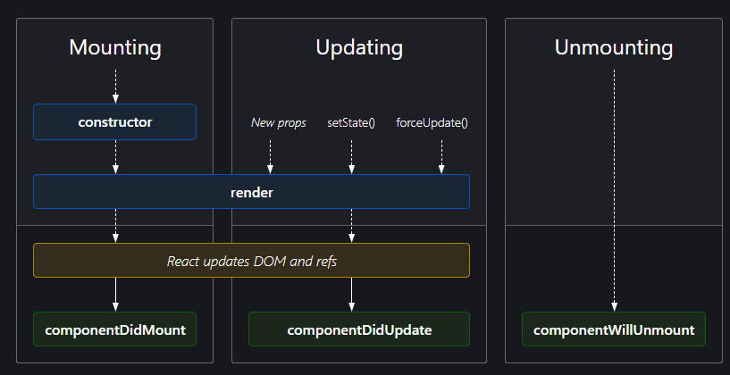
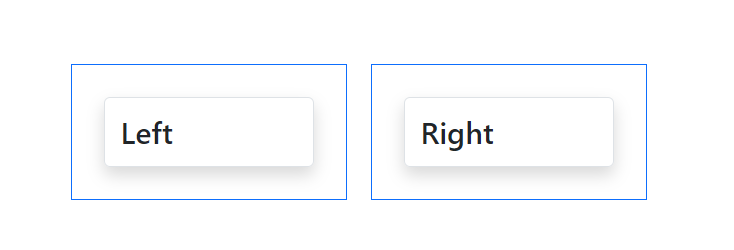

# 6. Библиотека React. Средний фундаментальный уровень

[6.1 API](#61-api)<br/>
[6.2 Жизненный цикл компонентов](#62-жизненный-цикл-компонентов)<br/>
[6.3 Предохранители](#63-предохранители)<br/>
[6.4 PropTypes](#64-proptypes)<br/>
[6.5 Render-props паттерн](#65-render-props-паттерн)<br/>
[6.6 Что такое **ref** и зачем он нужен](#66-что-такое-ref-и-зачем-он-нужен)<br/>
[6.7 Порталы](#67-порталы)<br/>

## 6.1 API

1. [An API of Ice And Fire](https://anapioficeandfire.com/)
2. [The RESTful Pokémon API](https://pokeapi.co/)
3. [Marvel](https://developer.marvel.com/)
4. [Weather API](https://openweathermap.org/api)
5. [News API](https://newsapi.org/)
6. [Public API](https://github.com/public-apis/public-apis)

## 6.2 Жизненный цикл компонентов

1. Монтирование
   - constructor
   - render
   - mount
2. Обновление
   - render
   - update
3. Размонтирование
   - unmount

[Диаграмма жизненного цикла](https://projects.wojtekmaj.pl/react-lifecycle-methods-diagram/)



[О жизненном цикле компонентов](https://ru.legacy.reactjs.org/docs/react-component.html#the-component-lifecycle)

## 6.3 Предохранители

Предохранители ловят ошибки в методах:
1. `render()`
2. жизненного цикла
3. конструкторах дочерних компонентов

Предохранители НЕ ловят ошибки:
1. которые произошли внутри обработчиков событий, потому что ошибки произошли вне метода `render()`
2. асинхронный код - мы не знаем, когда эта операция закончиться
3. в самом предохранителе
4. серверный рендеринг


## 6.4 PropTypes

[PropTypes documentation](https://ru.legacy.reactjs.org/docs/typechecking-with-proptypes.html)

```javascript
const DynamicGreating = (props) => {
   return (
           <div className={'mb-3 p-3 border border-' + props.color}>
              {
                 React.Children.map(props.children, child => {
                    return React.cloneElement(child, {className: 'shadow p-3 m-3 border rounded'})
                 })
              }
           </div>
   )
}

function App() {
   return (
           <Wrapper>
              <DynamicGreating color={'primary'}>
                 <h2>This weel was hard</h2>
                 <h2>Hello world</h2>
              </DynamicGreating>
              <WhoAmI name="John" surname="Doe" link="facebook.com"/>
              <WhoAmI name="Alex" surname="Smith" link="insta.com"/>
           </Wrapper>
   );
}
```

Создали компоненты, которые формируются динамически и не знают о том, что будет внутри

```javascript
<Container className="mt-5 mb-5">
   <Row>
      <Col>
         {props.left}
      </Col>
      <Col>
         {props.right}
      </Col>
   </Row>
</Container>

// Данные передаются из главного файла в форме пропсов

<BootstrapTest
        left={
           <DynamicGreating color={'primary'}>
              <h2>Left</h2>
           </DynamicGreating>
        }
        right = {
           <DynamicGreating color={'primary'}>
              <h2>Right</h2>
           </DynamicGreating>
        }
/>
```

Вместе мы их применили, и получаем результат:



## 6.5 Render-props паттерн

У нас есть какой-то компонент, который зависит от состояния своего родителя:

```javascript
const Message = (props) => {
   return (
           <h2>The counter is {props.counter}</h2>
   )
}
```
Данный компонент принимает на входе пропс (свойство), которой будет проходить в компонент.

Дальше, у еас есть другой компонент, который является классом

```javascript
class Counter extends Component {
   state = {
      counter: 0
   }

   changeCounter = () => {
      this.setState(({counter}) => ({
         counter: counter + 1
      }));
   }

   render() {
      return (
              <>
                 <button
                         className={'btn btn-primary'}
                         onClick={this.changeCounter}>
                    Click Me
                 </button>
              </>
      );
   }
}
```

Компонент Message может в себе содержать абсолютно любое сообщение с пропсом, это совершенно независимый компонент. Тоже саиде класс Counter, который имеет свое состояние, и он рендерит просто какую-то кнопку, которая меняет это состояние. 

Задача: связать эти два компонента так, чтобы они были независимы друг от друга, но при этом, чтобы компонент Message был внутри компонента Counter и использовал его состояние?

Можно было бы сделать так: `<Message counter={this.state.counter}/>`, но это будет жесткая привязка одного компонента к другому, и если потом будет необходим такой же компонент Counter, то придется этот компонент целиком создавать еще раз с разницей в использовании элемента в рендере. 

Решение: Чтобы не терять гибкости кода, применяется прием **Render-props**: в свойство нашего компоненты мы должны передать что-то, что будет рендерить какую-то определенную структуру внутри компонента. И если речь идет о действии, то это должна быть функция. Как проперти в этот компонент мы можум передать функцию, которая будет запускаться внутри другого компонента и что-то делать, например рендерить какую-то структуру. И выглядит это так:

Компонент Counter:
```javascript
render() {
   return (
           <>
              <button
                      className={'btn btn-primary'}
                      onClick={this.changeCounter}>
                 Click Me
              </button>
              {this.props.render(this.state.counter)} <!--Это проперти, который приходит из главной компоненты приложения-->
           </>
   );
}
```

Главная компонента приложения:
```javascript
 <Counter render={counter => (
     <Message counter={counter}/>
)}/>
```

## 6.6 Что такое **ref** и зачем он нужен

Когда мы хотим что-то сделать с дочерним компонентом без его перерисовки, используют прием с  **ref-ами**. Чаще всего используют в компонентах с формами и при работе с фокусом. **ref** - это ссылка на компонент или элемент в DOM-дереве, т.е. уже отрисованном интерфейсе на странице.

<u>Задача:</u> Как сделать так, чтобы при загрузке компонента формы, фокус сразу устанавливался на первый input?

<u>Решение:</u> использовать **ref**.
1. В конструкторе класса создается ссылка командой `React.createRef()`
```javascript
constructor(props) {
   super(props);
   this.myRef = React.createRef();
}
```
2. Теперь эту ссылку (**ref**) нужно присвоить к нужному нам элементу.
```javascript
<input
        ref={this.myRef}
        type="email"
        className="form-control" id="exampleFormControlInput1"
        placeholder="name@example.com"/>
```
3. Теперь мы можем ее использовать. 
```javascript
componentDidMount() {
   this.myRef.current.focus();
}
```

1. **ref** назначаются перед `componentDidMount()` и `componentDidUpdate()`, когда элемент размонтируется, то установиться автоматически значение null, т.е. не нужно нам делать отписку.
2. **ref** нельзя назначать на функциональные компоненты. 

Еще есть **callback ref** -  это когда мы создаем не при помощи `React.createRef()`, а при помощи функции и записываем ссылку на экземпляр класса. Если используется прием **callback ref**, то при обращении к **ref** не будет **current** - записывается чистая ссылка.

```javascript
setInputRef = (elem) => {
        this.myRef = elem;
    }

    focusFirst = () => {
        if (this.myRef) {
            this.myRef.focus();
        }
    }
```

## 6.7 Порталы

<u>Задача:</u> Имеется сообщение в форме, но в настоящий момент оно обрезано контентом, а мы хотим, чтобы его было полностью видно.

<u>Один из вариантов:</u> чтобы наша структура рендерилась где-то в другом месте ДОМ-дерева, но при этом хорошо было бы сохранить структуру дерева Реакт-компонентов, чтобы здесь все не переписывать и не связывать потом кучу логики сквозь компоненты. Этим как раз занимаются **порталы**. Они позволяют отренедерить компонент вне своего родительского компонента.

Для создания портала необходимо:
1. импортировать ReactDom компонент
2. элемент, который необходимо показать, необходимо вынести в отдельный компонент
```javascript
const Msg = () => {
   return (
           <div
                   style={{'width': '500px',
                      'height': '150px',
                      'backgroundColor': 'red',
                      'position': 'absolute',
                      'right': '-50%',
                      'bottom': '-50%'}}>
              Hello
           </div>
   )
}
```
3. Создадим портал. Обычно для них создается отдельный компонент, отвечающий за их создание
```javascript
const Portal = (props) => {
   const node = document.createElement('div');
   document.body.appendChild(node);

   return createPortal(props.children, node);
}
```
4. Теперь мы можем использовать этот портал
```javascript
<Portal>
   <Msg/>
</Portal>
```

Если на форму например повесить обработчик событий, то он будет актуальный и для блока, который мы отделили пр помощи портала, т.е. события происходящие с этим портальным элементом имеют эффект и на родительский элемент. 

[Heroku](https://www.heroku.com/)
[Deploy](https://create-react-app.dev/docs/deployment/)
[Bandling](https://trask.udemy.com/course/javascript_full/learn/lecture/28653874#overview)
