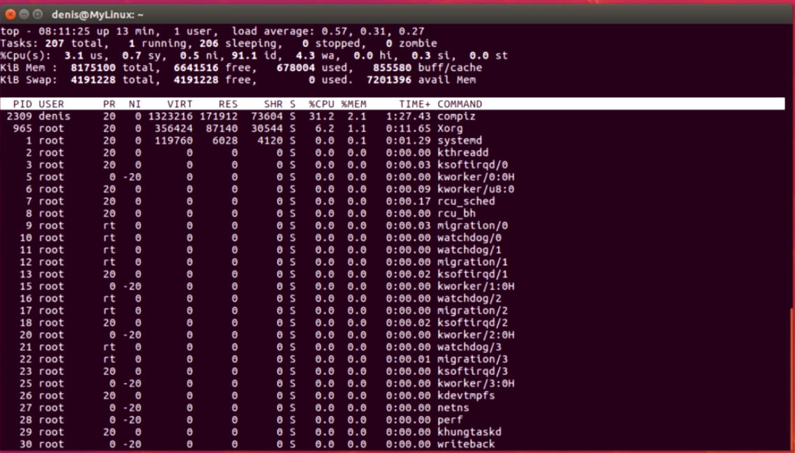

# Linux

## Содержание

[1. Установка и подготовка Linux](#1-installation-linux-to-pc-and-introduction)<br>
[1.1 Установка VM](#11-installation-vm)<br>
[1.2 Подговка терминала](#12-prepeare-of-terminal)<br><br>
[2. Работа с терминалом, основные команды](#2-work-with-terminal-and-base-commands)<br>
[2.1 Базовые команды](#21-base-commands)<br>
[2.2 Навигация по файлам и директориям](#22-files-and-directories-navigation)<br>
[2.3 Работа с файлами](#23-work-with-files)<br>
[2.4 Работа с директориями](#24-work-with-direstories)<br>
[2.5 Создание линков](#25-links-creating)<br>
[2.6 Команды *find, cut, sort, wc, | (pipe)*](#26-commands-find-cut-sort-wc--pipe)<br>
[2.7 Команды *grep* and regular expressions](#27-command-grep-and-regular-expressions)<br>
[2.8 Перенаправление вывода](#28-redirection-of-output)<br>
[2.9 Архивация и сжатие tar, zip, gzip, bzip2, xz](#29-archiving-and-compression-of-data-tar-zip-gzip-bzip2-xz)<br>
[2.10 Память и процессы: ***top, free, ps, dmesg***](#210-memory-and-processes-top-free-ps-dmesg)<br>
[2.11 Редактирование файлов: ***gedit, pico, nano, vim***](#211-редактирование-файлов-gedit-pico-nano-vim)<br><br>
[3 Продвинутые темы Linux](#3-продвинутые-темы-linux)<br>
[3.1 Типы аккаунтов: root, standard, admin](#31-типы-аккаунтов-root-standard-admin)<br>


## 1. Installation Linux to PC and introduction

### 1.1 Installation VM

1. Source for installation [Oracle VirtualBox](https://www.virtualbox.org/)
2. Download Linux operation system (**Ubuntu 22.04 LTS** for example)
3. Install to VM Linux -> all recomended settings but if tou want you can to change it after.
4. After installation Ubuntu starts in small window. To repeare this you can install additions from cd


### 1.2 Prepeare of terminal

1. Terminal -> preference -> Profiles -> Edit ptofile

2. What's mean in terminal?

    ```linux
    username@linux:~$
    username - is a current user
    linux - is a current server
    ~ - we are in ROOT directory
    ```

## 2. Work with terminal and base commands

### 2.1 Base Commands

|Command|Description|
|-:|:-|
|uptime|Show current time, how much the PC is running, how users are connected, load average|
|uname|Show current OS|
|uname -a|More details of current OS|
|lscpu|Processsor information|
|clear| Clear of window in terminal|
|ls|List of current directory. Show names of all files and directories in current directory|
|ls -l|List of current directory in details|
|ls -la|List of current directory in details and hidden files, **-a** -> ALL|
|echo|Show text. Using for programming scripts|
|echo $PATH|Environment variables. Show directories where Linux start searching commands from user|
|LALT+F3|Switch from GUI to text terminal|
|LALT+Fxx|New session where xx - number of your screen|
|LALT+F7|Switch back to GUI|
|man -k <word>|Show all commands and description of commands included key word. **man** -> manual, **-k** -> key word|
|CTRL+C|Cancel of some event|
|CTRL+Z|Go back from current process and this process still running in background|
|fg|Return to process which running on background|
|man \<command>|Full description of this command|
|/\<word>|Searching of word in file editor|
|q|Exit from file editor|
|info \<command>|Short description of this command|
|whatis \<command>|About command|
|whereis \<command>|Show path where is this command is placed|
|locate|Show path where is this command located. Used to find file|
|ps|Show which processes are running in current PC|
|ls -la -R /|List of all files, all directories in all disks|
|sudo|**S**uper**U**ser **DO** with admin permission. Need enter password|

### 2.2 Files And Directories Navigation

|Command|Description|
|-:|:-|
|cd \</path>|Change directory|
|cd /|Change directory to ROOT|
|pwd|Show you current directory path. **P**rint **W**orking **D**irectory|
|cd ..|Return back directory an one level up|
|cd ../..|Return back a two levels up|
|cd or cd ~|Return to home directory. **~** = /home/username|

### 2.3 Work with files

|Command|Description|
|-:|:-|
|cat \<filename>|Read the file|
|more \<filename>|Read file row-by-row. To read next row press Enter|
|less \<filename>|Read file, looks like "man": **arrow_up/arrow_down** to navigate, **/** to searching the word, **q** to quit from file|
|touch \<filename>|Create new file, if file is not exist|
|touch \<filename>|Update file with \<filename>|
|cp \</src_dir/filename> <dest_dir>|Copy file ***from*** source directory ***to*** target directory. Present absolute path to directories|
|rm \</src_dir/filename>|Remove file with \<filename>. Remove ***where*** and ***what***|
|cp \</src_dir/filename?> -v <dest_dir>|Copy file with name \<filename> and any symbol on place **?** ***!!ONLY ONE SYMBOL!!***. **-v** -> verbouse for visualisation of process|
|cp -R \<src_dir> <dest_dir>|Copy all files from one directory to another directory. **-R** -> recursevelly|
|mv \<filename> <new_filename>|Rename/replace file. dot before filename (\<.filename>) means that file is hidden. File will be replaced when \<new_filename> is directory absolute path.|

### 2.4 Work With Direstories

|Command|Description|
|-:|:-|
|mdkdir \<dir_name>|Create directory|
|mkdir -p \<abs_path_to_dir/new_dir_name>|Create directory inside new created directory. **-p** -> parent|
|mv \<old_dir_name> <new_dir_name>|Rename/replace directory|
|rmdir \<dir_name>|Remove directory ***ONLY IF DIRECTORY IS EMPTY***|
|RM -R \<dir_name*>|Remove directory. **-R** -> recursevelly, **\*** -> any symbols after directory name. That's mean it will delete all directories started with **\<dir_name>**|
|cp -R \<dir_name_1> <dir_name_2>|Copy one direcory to another recursevelly|
|sudo rm -R / --no-preserve-root|Remove all in **ROOT** directory. ***!!!DANGEROUS KILL THE LINUX OS!!!***|

### 2.5 Links creating

What is "link" - link is like shortcut to directory or to file, virtual presenting of file or directory. 

1. Symbolic link

    `username@lnux:~/Documents$ ln -s \<on_what> <where> <link_name>`

    Description:
    |Part of command|Description|
    |-:|:-|
    |ln|Create link command|
    |-s|Symbolic link|
    |\<on_what>|File or directory of link created. Always recomended to write absolute path to file or directory|
    |\<where>|Where you want to placed this link|
    |\<link_name>|Name of link|

2. Link as duplicate

    Duplicate is create ONLY on file.

    `username@lnux:~/Documents$ ln \<filename> <filename_duplicate>`

    This create idle duplicate of file with the same size, creating date and other fields.

    ```
    -rw-rw-r-- 2 username username 153 Nov 21 09:16 file1.txt
    -rw-rw-r-- 2 username username 153 Nov 21 09:16 file1duplicate.txt
    ```
    Number after attributes `-rw-rw-r--` show how much duplicates has file. If you change one of two files it will be changed both files. If you delete one of file another file will stay without changing.

### 2.6 Commands *find, cut, sort, wc, | (pipe)*

1. Command ***find***
    
    search for any files in a directory hierarchy

    `username@linux:~$ find <path> -name <filename>`

      Description:
    |Part of command|Description|
    |-:|:-|
    |find|Command|
    |\<path>|Where do you want to search file. Absolute path|
    |-name|Searching by filename. Can be another attribute|
    |\<filename>|Name of searching file. Can be for examples: |
    ||***"\*.txt"*** what means all files with extention txt|
    ||can be ***"file\*.txt"*** what means file with name start with ***file***|

2. Command ***wc*** - **W**ord **C**ount

    `username@linux:~$ wc \<filename>` 

    This comand is counting and present numbers of  raws, words and symbols in this file. This command can be used with different attributes:

    |Attribute|Description|
    |-:|:-|
    |-l| Present only number of raws|
    |-w|Present only number of words|
    |-s|Present only number of symbols|

3. Command ***sort***

    Used for sorting of file content without any changing of file - only present to display sorted content.

    `username@linux:~$ sort \<filename>`

    Using attribute **-n** - sorting of content by numbers order.

4. Command ***cut***

    Used for cutting and display only some content which we want to read. For this the first we need to find some delimiter between fields of one raw, for example **>** this symbol. 

    `username@linux:~$ cut -d ">" -f 3 \<filename>`

      Description:
    |Part of command|Description|
    |-:|:-|
    |cut|Command|
    |-d|Attribute delimiter|
    |">"|Delimiter what you want to use|
    |-f|Attribute number of fields|
    |3|Field bunber|
    |\<filename>|Name of file to analise|

5. Join commands with pipe

    We can start command by command in linux.

    `username@linux:~$ cut -d ">" -f 3 \<filename> | sort`

    | - is named ***pipe*** and it;s separate of commands. That's mean start first command and than after start second command and finally display the result of both commands.

### 2.7 Command *grep* and regular expressions

Command **grep** is using to search text in files. This command is case sensitive.

`username@linux:~/Documents$ grep \<search_word> <where_path>`

Description:
|Part of command|Description|
|-:|:-|
|grep|Command name|
|-i|Ignore case sensitive|
|linux|Word searched in file|
|./|Current directory|
|*|All files in the directory|

Regular expressions:
|Regular Expression|Description|
|-:|:-|
|[A-Z]*|Any words contains only capital letters|
|[0-9]*|Any numbers|
|[A-Za-z]*@[A-Za-z]*.com|Simple regular expression for searching of mails ends witn ***.com***|
|www\.[a-z]*\.com|Any web url ends with ***.com***|

### 2.8 Redirection of output

If we want to make some sorting for example and result of command *sort* save to another file we can use use redirection of output **\>** using this symbol.

`username@linux:~/Documents$ sort \<filename> > <new_filename>`

Description:
|Part of command|Description|
|-:|:-|
|sort|Awesome command which display result on terminal|
|\<filename>|Operated file|
|\<new_filename>|Target file to save the result of command operation. If file is not exist, file will create automatically. If you redirect output to file witch you operate (filename = new_filename) this file will be erase. **Reason:** this redirection first execute second part (create new file to save result) and after execute first part. And if you save result to the same file it will failed|

To append some content from another file use symbol **\>>**

`username@linux:~/Documents$ sort \<filename> >> <new_filename>`

Usefull command with ***grep*** - imagine we want to find some text in some directory which cam throw errors like permission denied or somethig like this and we want to save success result in one file and errors result in another file we can use next command:

`username@linux:~$ grep username /etc/* > good.txt 2> errors.txt`

Description:
|Part of command|Description|
|-:|:-|
|grep|Command|
|username|Searching word in files in directory|
|/etc/*|Awesome path where locate some file which we want to searched|
|>|Redirect of success result to file|
|good.txt|File with success result of searching|
|2>|Sort and redirect of error results of searching|
|error.txt|Resuy file with errors|

### 2.9 Archiving and compression of data tar, zip, gzip, bzip2, xz

1. Command **tar**

    Archiving is provided by command **tar** - **T**ape **AR**chive. This command combines files or directories into one file. tar command is not compress. <br>

    Example:<br>
    `username@linux:~/Documents$ tar cvf mytar.tar Folder1`

    Description:
    |Part of command|Description|
    |-:|:-|
    |tar|Command|
    |c|Create archive|
    |v|Verbouse for visualisation of process|
    |f|Archive as file. **f** always must be as last argument. It's important|
    |mytar.tar|File name with extension **.tar**. That's mean that will be created archive **.tar**|
    |Folder1|What we want to archiving. Can be some file, directories with all content etc|

    To test archive tar file we can use command<br>

    `username@linux:~/Documents$ tar tf mytar.tar`

    Description:
    |Part of command|Description|
    |-:|:-|
    |tar|Command|
    |t|Test tar file and display of content|
    |f|File|
    |mytar.tar|Source tar file|


    To unpack archive tar file we can use command<br>

    `username@linux:~/Documents$ tar xvf mytar.tar`

    Description:
    |Part of command|Description|
    |-:|:-|
    |tar|Command|
    |x|Extract tar file|
    |v|Verbouse|
    |f|File|
    |mytar.tar|Source tar file|

    To create archive file with **gzip** compression use next command:

    `username@linux:~/Documents$ tar cvzf myGZIP.gz Folder1`

    Description:
    |Part of command|Description|
    |-:|:-|
    |tar|Command|
    |c|Create archive|
    |v|Verbouse for visualisation of process|
    |z|Use **gzip** compression|
    |f|Archive as file. **f** always must be as last argument. It's important|
    |myGZIP.gz|File name with extension **.gz**. That's mean that will be created compressed archive **.gz**|
    |Folder1|What we want to archiving. Can be some file, directories with all content etc|
    
    To create archive file with **bzip2** compression use next command:

    `username@linux:~/Documents$ tar cvjf myBZIP.bz2 Folder1`

    Description:
    |Part of command|Description|
    |-:|:-|
    |tar|Command|
    |c|Create archive|
    |v|Verbouse for visualisation of process|
    |j|Use **bzip2** compression|
    |f|Archive as file. **f** always must be as last argument. It's important|
    |myBZIP.bz2|File name with extension **.bz2**. That's mean that will be created compressed archive **.bz2**|
    |Folder1|What we want to archiving. Can be some file, directories with all content etc|
    
    To create archive file with **xz** compression use next command:

    `username@linux:~/Documents$ tar cvJf myX|.xz Folder1`

    Description:
    |Part of command|Description|
    |-:|:-|
    |tar|Command|
    |c|Create archive|
    |v|Verbouse for visualisation of process|
    |J|Use **xz** compression|
    |f|Archive as file. **f** always must be as last argument. It's important|
    |myBZIP.bz2|File name with extension **.xz**. That's mean that will be created compressed archive **.xz**|
    |Folder1|What we want to archiving. Can be some file, directories with all content etc|

2. Commands **gzip, bzip2, xz**

    Commands **gzip, bzip2, xz** needs to compress of only one file, not some files or directory but **ONLY** one file. 

    Example:<br>
    `username@linux:~/Documents$ gzip mytar.tar`

    Description:
    |Part of command|Description|
    |-:|:-|
    |gzip|Command|
    |mytar.tar|File for compression. After compression it's append **.gz** extension|

    To decompress gzip file use next command:

    Example:<br>
    `username@linux:~/Documents$ gunzip mytar.tar.gz`

    Description:
    |Part of command|Description|
    |-:|:-|
    |gunzip|Command|
    |mytar.tar.gz|File for decompression.|

    The similar as gzip command is command bzip2. Using this command is better for compression.

    Example:<br>
    `username@linux:~/Documents$ bzip2 mytar.tar`

    Description:
    |Part of command|Description|
    |-:|:-|
    |bzip2|Command|
    |mytar.tar|File for compression. After compression it's append **.bz2** extension|

    To decompress bz2 file use next command:

    Example:<br>
    `username@linux:~/Documents$ bunzip2 mytar.tar.bz2`

    Description:
    |Part of command|Description|
    |-:|:-|
    |bunzip2|Command|
    |mytar.tar.bz2|File for decompression.|

    The similar as gzip or bzip2 command is command xz.

    Example:<br>
    `username@linux:~/Documents$ xz mytar.tar`

    Description:
    |Part of command|Description|
    |-:|:-|
    |xz|Command|
    |mytar.tar|File for compression. After compression it's append **.xz** extension|

    To decompress xz file use next command:

    Example:<br>
    `username@linux:~/Documents$ unxz mytar.tar.xz`

    Description:
    |Part of command|Description|
    |-:|:-|
    |unxz|Command|
    |mytar.tar.xz|File for decompression.|

### 2.10 Memory and processes: ***top, free, ps, dmesg***

The simple base command in Linux is **top* - it is Task Manager in Linux, display all running on PC. Start with nex command:

`username@linux:~$ top`



Посмотреть количество свободной памяти команда **free**

`username@linux:~$ free`

Показывает количество памяти в байтах. Чтобы посмотреть в более человеческом виде, следующая команда:

`username@linux:~$ free -h` - где -h - **human**

Самая используемая команда ***ps***. Показывает процессы, завущенные данным пользователем. Чтобы посмотреть запущенные процессы другого пользователя:

`username@linux:~$ ps -u \<username>` - **-u** - **U**ser, username - имя пользователя, процессы которого мы хотим посмотреть. При выводе показывает абсолютно все процессы пользователя. 

Команда 
`username@linux:~$ ps x`
показывает вообще все процессы всех пользователей.

Команда
`username@linux:~$ ps -aux`

выводит на экран информацию о всех процессах всех пользователей детально.

|Часть|Описание|
|-:|:-|
|ps|Команда|
|-a|ALL все процессы|
|u|USER пользвателя|
|x|EXTEND расширенный формат|

Где хранятся логи? В папке **/var/log ** все все логи.

`username@linux:~$ cd /var/log`

Лог, который не записывается на диске, находится в памяти и живет, только пока компьютер включен:

`username@linux:/var/log$ dmesg`

Это лог Линуксовского ядра. Используется при troubleshooting.

### 2.11 Редактирование файлов: ***gedit, pico, nano, vim***

Несколько редакторов. Самый простой **gedit**. Как *notepad* в Windows. Это вариант, когда есть GUI.

Когда нет GUI:

1. ***nano*** - самый классный. Удобный.
2. ***pico*** - тоже самое, что и ***nano***
3. ***vi*** или ***vim*** - самый древний

## 3 Продвинутые темы Linux

### 3.1 Типы аккаунтов: root, standard, admin

Виды аккаунтов: **Standard**, **Administrator**. Есть еще один вид аккаунтов, его не создают, а он создается автоматически при установке Linux, это аккаунт **root** Других аккаунтов нет. Администратор аккаунт может использовать команду **sudo**, стандарт акккаунт нет.